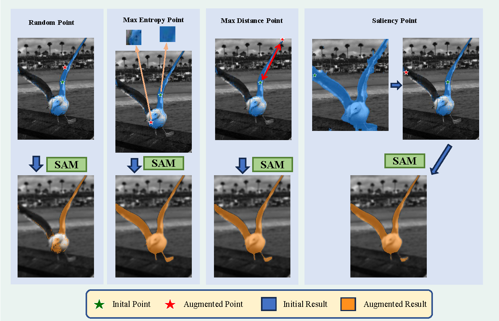

# SAMAug: Point Prompt Augmentation for Segment Anything Model
\[In submission\] Code for: [SAMAug: Point Prompt Augmentation for Segment Anything Model](https://arxiv.org/abs/2307.01187)

This paper introduces SAMAug, a novel visual point augmentation method for the Segment Anything Model (SAM) that enhances interactive image segmentation performance. SAMAug generates augmented point prompts to provide more information to SAM. From the initial point prompt, SAM produces the initial mask, which is then fed into our proposed SAMAug to generate augmented point prompts. By incorporating these extra points, SAM can generate augmented segmentation masks based on the augmented point prompts and the initial prompt, resulting in improved segmentation performance. We evaluate four point augmentation techniques: random selection, maximum difference entropy, maximum distance, and a saliency model. Experiments on the COCO, Fundus, and Chest X-ray datasets demonstrate that SAMAug can boost SAM's segmentation results, especially using the maximum distance and saliency model methods. SAMAug underscores the potential of visual prompt engineering to advance interactive computer vision models.

Our framework is as follows.

</img>

## Environment

To set up the environment, use the command `pip install -r requirments.txt`

Download the pretrain model ***sam_vit_h_4b8939.pth*** and place it under the root folder.

## Dataset 
All the dataset are public dataset, you can download them in the official webset. After downloaded the dataset, please put then under **data** folder.

## How to run

 First, you need set up the environment and downlaod the pretrained model, then you can get the augmented result by SAMAug. 

To run the model/method:
    
    python SAMAug.py  

## Citation
@article{dai2023samaug,
  title={SAMAug: Point Prompt Augmentation for Segment Anything Model},
  author={Dai, Haixing and Ma, Chong and Liu, Zhengliang and Li, Yiwei and Shu, Peng and Wei, Xiaozheng and Zhao, Lin and Wu, Zihao and Zhu, Dajiang and Liu, Wei and others},
  journal={arXiv preprint arXiv:2307.01187},
  year={2023}
}